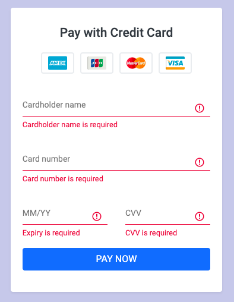

# Credit Card Payment Form
This is a simple form for taken the Credit Card payment. It will validate the fields has data or not and type of the Credit Card. I have used ReactJs, NextJs, Bootstrap, and SASS to build the form. It is a responsive design. 

## Credit Card Payment Form
An outlook of the form:<br/>


Another outlook, when all fields are empty:<br/>


Final outlook, when all fields are valid:<br/>


## Console output
```html
{
  name: "Jhon Smith"
  number: "5105105105105100"
  expiry: "09/21"
  security: "123"
}
```
## About me
I am Front-end web developer with 5 years of experience. Alongside this, I am also working with the Laravel framework. For more about me please check my Website(https://sonjoydatta.me) or LinkedIn(https://www.linkedin.com/in/sonjoydatta/) profile.
